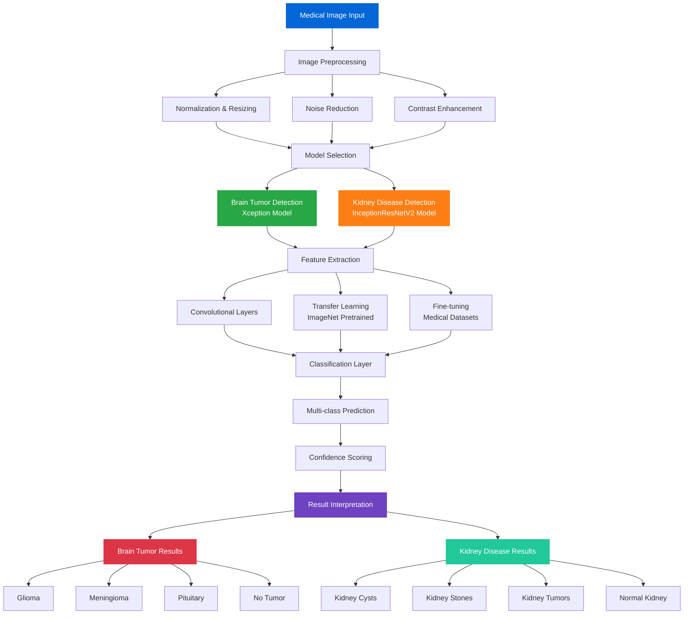
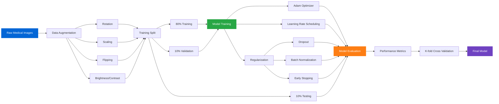

<div align="center">
  


**Advanced Medical Image Analysis Platform powered by Deep Learning**

[](https://meddetectai-health-hub.lovable.app)
[](LICENSE)
[](https://python.org)
[](https://tensorflow.org)
[]()

</div>


## 🚀 Overview

MedDetectAI is a cutting-edge medical image analysis platform that leverages state-of-the-art deep learning models to assist in the detection and classification of critical medical conditions. Our platform combines advanced computer vision techniques with medical expertise to provide accurate, fast, and reliable diagnostic assistance.

### 🎯 Key Features

- **🧠 Brain Tumor MRI Detection** - Advanced neural network analysis of brain MRI scans
- **🫘 Kidney Disease Detection** - Comprehensive kidney imaging analysis
- **⚡ Real-time Processing** - Fast and efficient image analysis
- **📊 Confidence Scoring** - Detailed probability distributions for each diagnosis
- **🔬 Research-Grade Accuracy** - Models trained on extensive medical datasets

---

## 🏥 Medical Modules

### 1. Brain Tumor MRI Detection

Our brain tumor detection module uses a fine-tuned **Xception architecture** to analyze MRI scans and identify tumor types with high precision.

#### 🎯 Detection Categories
- **Glioma Tumors** - Malignant tumors originating in glial cells
- **Meningioma Tumors** - Typically benign tumors from the meninges
- **Pituitary Tumors** - Hormone-affecting tumors in the pituitary gland
- **No Tumor** - Normal brain tissue classification

#### 🔧 Technical Specifications
- **Base Architecture:** Xception (ImageNet pretrained)
- **Input Resolution:** 299×299 pixels
- **Training Dataset:** Thousands of annotated MRI images
- **Classification Output:** 4 categories with confidence scores

#### 📋 Clinical Information
- **Glioma:** Represents 33% of all brain tumors, 80% of malignant cases
- **Meningioma:** Accounts for 37% of primary brain tumors
- **Pituitary:** Comprises 10-15% of all brain tumors

### 2. Kidney Disease Detection

Our kidney disease detection system utilizes a fine-tuned **InceptionResNetV2 model** for comprehensive renal imaging analysis.

#### 🎯 Detection Categories
- **Kidney Cysts** - Fluid-filled sacs detection
- **Kidney Stones** - Mineral deposit identification
- **Kidney Tumors** - Benign and malignant growth detection
- **Normal Kidney** - Healthy tissue classification

#### 🔧 Technical Specifications
- **Base Architecture:** InceptionResNetV2
- **Input Resolution:** 244×244 pixels
- **Training Dataset:** Comprehensive kidney imaging dataset
- **Classification Output:** 4 categories with confidence scores

---
## 📈 Model Performance

| Model | Accuracy | 
|-------|----------|
| Brain Tumor MRI Detection | 99.54% | 
| Kidney Disease Detection | 99.52% | 

---

## 🔬 Technical Architecture



### Model Training Pipeline



---

## 🛠️ Installation

### Prerequisites
```bash
Python 3.8+
TensorFlow 2.x
NumPy
Pillow
Streamlit (for web interface)
```

### Quick Setup
```bash
# Clone the repository
git clone https://github.com/yourusername/MedDetectAI.git
cd MedDetectAI

# Install dependencies
pip install -r requirements.txt

# Run the application
streamlit run app.py
```

---

## 🚀 Usage

### Web Interface
1. Launch the application using `streamlit run app.py`
2. Select the desired medical module (Brain Tumor or Kidney Disease)
3. Upload your medical image (MRI scan or kidney imaging)
4. View real-time analysis results with confidence scores
5. Download detailed reports for medical review


---

## ⚖️ Medical Disclaimer

> [!CAUTION]
> **🚨 CRITICAL MEDICAL DISCLAIMER**
> 
> This application is designed for **educational and research purposes only**. It is not intended to replace professional medical diagnosis, advice, or treatment.

> [!WARNING]
> **⚠️ IMPORTANT SAFETY NOTICE**
> 
> **Key Points:**
> - Always consult qualified healthcare providers for medical decisions
> - Results may contain false positives and false negatives
> - Not FDA approved for clinical diagnostic use
> - Requires validation by medical professionals
> - Should not be used as the sole basis for medical decisions

---
